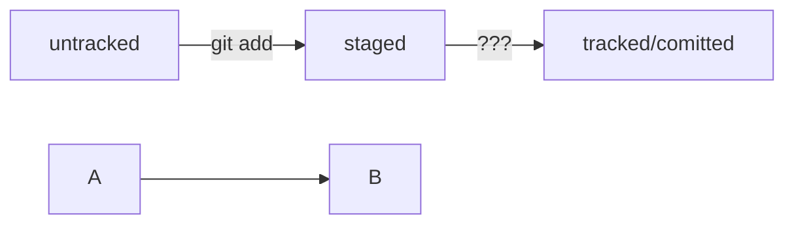

# Basic command

*git init* - создали репозиторий

*git add --all* или *git add file.txt* добавили в отслеживаемые файлы

*git status* - посмотрели текущее состояние

*git commit -m 'comment'* - выполнили коммит с комметарием

*git log* - список коммитов

*git remote -v* показывает, что репозитории связаны

HEAD - голова

Git log --oneline - сокращённый список коммитов

